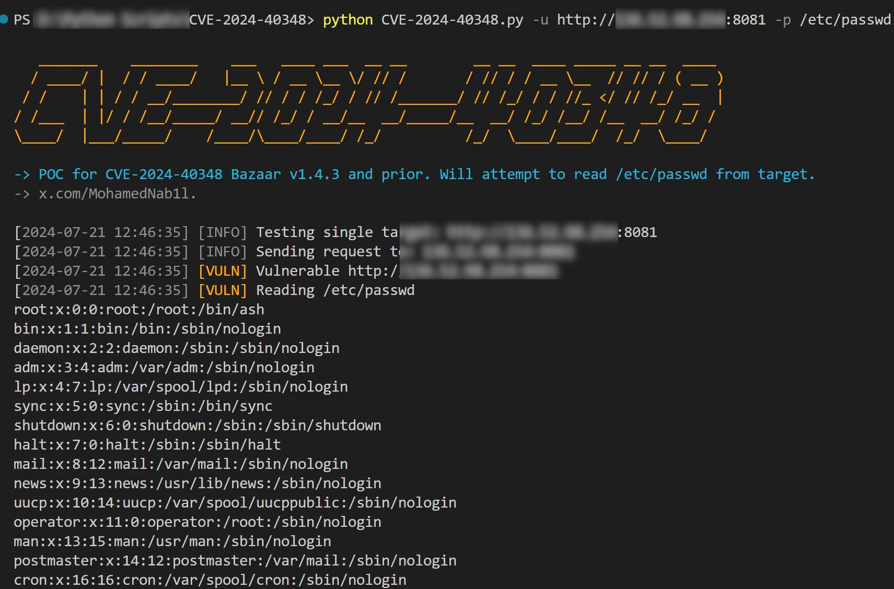

# CVE-2024-40348
POC for CVE-2024-40348 Bazaar v1.4.3 and prior. Will attempt to read /etc/passwd from target.




## Overview

This is a bulk scanning and exploitation tool for CVE-2024-40348: Bazaar v1.4.3 allows unauthenticated attackers to execute a directory traversal. This vulnerability was discovered by [4rdr](https://github.com/4rdr/proofs/blob/main/info/Bazaar_1.4.3_File_Traversal_via_Filename.md).

## How to Use

### Minimum Requirements

- Python 3.6 or higher
  
### Single Target:
```sh
python CVE-2024-40348.py -u http://target:7809 -p /etc/passwd
```

### Bulk Sscan:
```sh
python CVE-2024-40348 -f file.txt -p /etc/passwd
```

## Contact

For any suggestions or thoughts, please get in touch with [me](https://x.com/MohamedNab1l).


## Disclaimer

I like to create my own tools for fun, work and educational purposes only. I do not support or encourage hacking or unauthorized access to any system or network. Please use my tools responsibly and only on systems where you have clear permission to test.

## References

- https://nvd.nist.gov/vuln/detail/CVE-2024-40348
- https://github.com/4rdr/proofs/blob/main/info/Bazaar_1.4.3_File_Traversal_via_Filename.md

